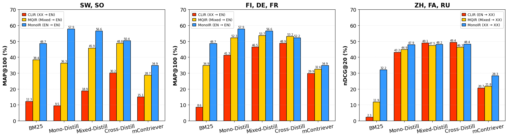

# MiLQ: Benchmarking IR Models for Bilingual Web Search with Mixed Language Queries

---

Official repository for **"MiLQ: Benchmarking IR Models for Bilingual Web Search with Mixed Language Queries"** (EMNLP 2025 Main).

[](https://aclanthology.org/2025.emnlp-main.1153/) [](https://catalog.elra.info/en-us/repository/browse/ELRA-E0047/)


## 📊 MiLQ

**TL;DR**: MiLQ is the first benchmark for evaluating retrieval models on realistic mixed-language queries preferred by bilingual speakers.

### Experiment Results

<p align="center">
  
</p>

**Key Findings:**
- Existing IR models (Mono-, Cross-Distill) show moderate but unstable MQIR performance across scenarios, underscoring the need for more robust systems for bilinguals’ flexible querying.

- Mixed-language queries (MQIR) markedly outperform native queries (CLIR) in English document retrieval, offering a clear strategic edge for bilingual users.

For more details, see our [paper](https://aclanthology.org/2025.emnlp-main.1153/). To reproduce results or use MiLQ, see **Reproduction Guide** below.

### Dataset

The MiLQ dataset is available through **ELRA** (European Language Resources Association):

🔗 **Dataset Link:** [ELRA-E0047](https://catalog.elra.info/en-us/repository/browse/ELRA-E0047/)
- **ISLRN:** 200-586-423-805-2
- **License:** Evaluation Use - ELRA EVALUATION (Free)
- **Citation:** If you use this dataset, please include the following citation in your acknowledgements: *"MiLQ:Mixed-Language Query Test Set for Bilingual Web Search - Evaluation Package, ELRA catalogue (http://catalog.elra.info), ISLRN: 317-005-302-361-6, ELRA ID: ELRA-E0047"*

---

## Reproduction Guide

### 1. Environment Setup

```bash
# Install uv
curl -LsSf https://astral.sh/uv/install.sh | sh

# Clone repository
git clone https://github.com/jonghwi-kim/milq.git
cd milq

# Install dependencies
uv sync
```

### 2. Test Data Preparation

**CLEF Test Suite** ([ELRA-E0008](https://catalog.elra.info/en-us/repository/browse/ELRA-E0008/)) - Registration and purchase required

**NeuCLIR 2022** ([NIST](https://catalog.data.gov/dataset/2022-neuclir-dataset)) - Publicly available

```bash
bash scripts/preprocess_clef.sh ./data/clef
bash scripts/preprocess_neuclir.sh [--download] ./data/neuclir
```

### 3. Model Training (ColBERT)

**Download training data:**

```bash
bash scripts/download_msmarco.sh ./data/msmarco
```

This downloads MS MARCO (en), mMARCO (fr, de), NeuMARCO (fa, zh, ru), plus teacher scores from an mt5-xxl cross-encoder.

**Translate additional languages:**

```bash
bash scripts/translate.sh swahili swh_Latn
bash scripts/translate.sh somali som_Latn
bash scripts/translate.sh finnish fin_Latn
```

For languages without an existing translated MS MARCO version, we directly generate translations using NLLB-200. For language codes, see [FLORES-200](https://github.com/facebookresearch/flores/blob/main/flores200/README.md).

**Apply code-switching for Mixed-Distill:**

```bash
bash scripts/codeswitch.sh english chinese MUSE/en-zh.json
bash scripts/codeswitch.sh english swahili PanLex/eng-swh.json
```

Mixed-language queries are generated via lexicon-based code-switching. All lexicon files are available under `data/lexicon`.

**Train ColBERT-X:**

```bash
# Train Cross-Distill (ex. English queries -> Chinese docs)
bash scripts/train_colbert.sh english chinese

# Train Mono-Distill (ex. Chinese queries -> Chinese docs)
bash scripts/train_colbert.sh chinese chinese

# Train Mixed-Distill (ex. English & Chinese Code-switched queries -> Chinese docs)
bash scripts/train_colbert.sh english_chinese chinese
```

Arguments:
- `<query_lang>`: Query language (ex. `english_chinese`)
- `<doc_lang>`: Document language (ex. `chinese`)

Uses local training data:
- Queries: `data/msmarco/<query_lang>/<query_lang>_queries.tsv`
- Documents: `data/msmarco/<doc_lang>/<doc_lang>_collection.tsv`
- Teacher scores: `data/msmarco/teacher-scores/mt5xxl-monot5-mmarco-engeng.jsonl`

Checkpoints saved to `experiments/milq/none/<query_lang>_<doc_lang>/...`.

### 4. Evaluation

**Index and Search with ColBERT-X:**

```bash
bash scripts/index_search_colbert.sh eng zho
```

Arguments:
- `<query_lang>`: Query language (ex. `eng_zho`)
- `<doc_lang>`: Document language (ex. `fas`, `zho`, `rus`)


**NeuCLIR:**
  - Collection: `data/neuclir/<doc_lang>/<doc_lang>_passages_xlm-roberta-large_180_90.tsv`
  - Queries: `data/neuclir/<doc_lang>/<query_lang>_queries_concat.tsv`
  - Mapping: `data/neuclir/<doc_lang>/<doc_lang>_mapping_xlm-roberta-large_180_90.tsv`
  - Qrels: `data/neuclir/<doc_lang>/2022-qrels.<doc_lang>`

**CLEF:**
  - Collection: `data/clef/docs/<doc_lang>_<year>_passages_bert-base-multilingual-uncased_180_90.tsv`
  - Queries: `data/clef/queries/<query_lang>_2000-2003_queries_concat.tsv`
  - Mapping: `data/clef/docs/<doc_lang>_<year>_mapping_bert-base-multilingual-uncased_180_90.tsv`
  - Qrels: `data/clef/qrels/en_2000-2003_qrels.tsv`

**BM25 and Contriever:**

For BM25 and Contriever baselines, refer to [Pyserini](https://github.com/castorini/pyserini). 
Feel free to contact us with any questions.


## 📝 Citation

If you use MiLQ in your research, please cite:

```bibtex
@inproceedings{kim-etal-2025-milq,
    title = "{M}i{LQ}: Benchmarking {IR} Models for Bilingual Web Search with Mixed Language Queries",
    author = "Kim, Jonghwi  and Kang, Deokhyung  and Hwang, Seonjeong  andKim, Yunsu  andOk, Jungseul  and Lee, Gary",
    editor = "Christodoulopoulos, Christos  and  Chakraborty, Tanmoy  and Rose, Carolyn  and Peng, Violet",
    booktitle = "Proceedings of the 2025 Conference on Empirical Methods in Natural Language Processing",
    month = nov,
    year = "2025",
    address = "Suzhou, China",
    publisher = "Association for Computational Linguistics",
    url = "https://aclanthology.org/2025.emnlp-main.1153/",
    doi = "10.18653/v1/2025.emnlp-main.1153",
    pages = "22654--22670",
    ISBN = "979-8-89176-332-6"
    "
}
```
